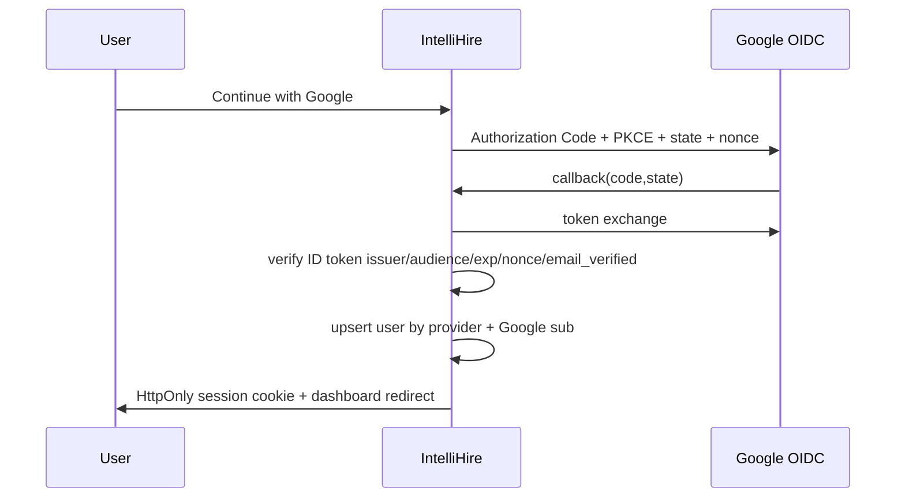

# IntelliHire Authentication and AI Architecture

## Architecture

IntelliHire uses a Next.js BFF architecture: browser pages call same-origin route handlers, while the backend validates Google OpenID Connect claims and stores server-managed sessions in PostgreSQL via Prisma.

## Google Cloud OAuth setup

Create an OAuth web client in Google Cloud Console. Configure authorized redirect URI as `GOOGLE_REDIRECT_URI`, for example `http://localhost:3000/api/auth/google/callback` locally and the production HTTPS equivalent in production. JavaScript origins are only required for browser JS Google SDKs; IntelliHire uses backend redirects, but adding `APP_URL` is acceptable.

## Local development

1. Copy `.env.example` to `.env` and fill values locally only.
2. Run `npm install`.
3. Run `npx prisma migrate dev` against PostgreSQL.
4. Run `npm run dev`.

## Environment variables

Required for Google auth: `GOOGLE_CLIENT_ID`, `GOOGLE_CLIENT_SECRET`, `GOOGLE_REDIRECT_URI`, `SESSION_SECRET`, `APP_URL`, and `DATABASE_URL`. Optional Redis is represented by `REDIS_URL`; Redis should be used for distributed OAuth state, permission cache, and rate-limit counters when deployed across multiple instances.

## Session model

Sessions are opaque random tokens stored only in HttpOnly cookies. The database stores SHA-256 token hashes, expiration, revocation data, device metadata, and user-agent/IP metadata. Users can revoke the current session, all sessions, or an individual device session.

## Authorization model

Roles are `USER` and `ADMIN`. Permission checks are centralized through `requireAuth`, `requireRole`, and `requirePermission`; future modules should depend on these guards rather than implementing their own auth logic.

## NVIDIA AI provider

NVIDIA access is server-side only through `AIService`, `AIProvider`, and `NvidiaAIProvider`. Modules request capabilities (`reasoning`, `text`, `vision`) and the model registry selects the configured model/API key. The provider implements timeout, cancellation, retry with backoff for retryable statuses, basic quota control, structured error mapping, correlation IDs, and secret redaction in logs.

## Testing

Unit tests mock external providers and do not require real Google or NVIDIA credentials. Add integration tests with a test database before production launch for full OAuth callback persistence behavior.

## Production deployment and security

Use HTTPS, strong `SESSION_SECRET`, secure cookies, strict CORS at the edge, CSP/security headers, database migrations, and secret-manager injected environment variables. Never commit `.env` files or provider keys. Validate Google issuer, audience, expiration, nonce, and `email_verified`; never trust profile data directly supplied by the browser.
